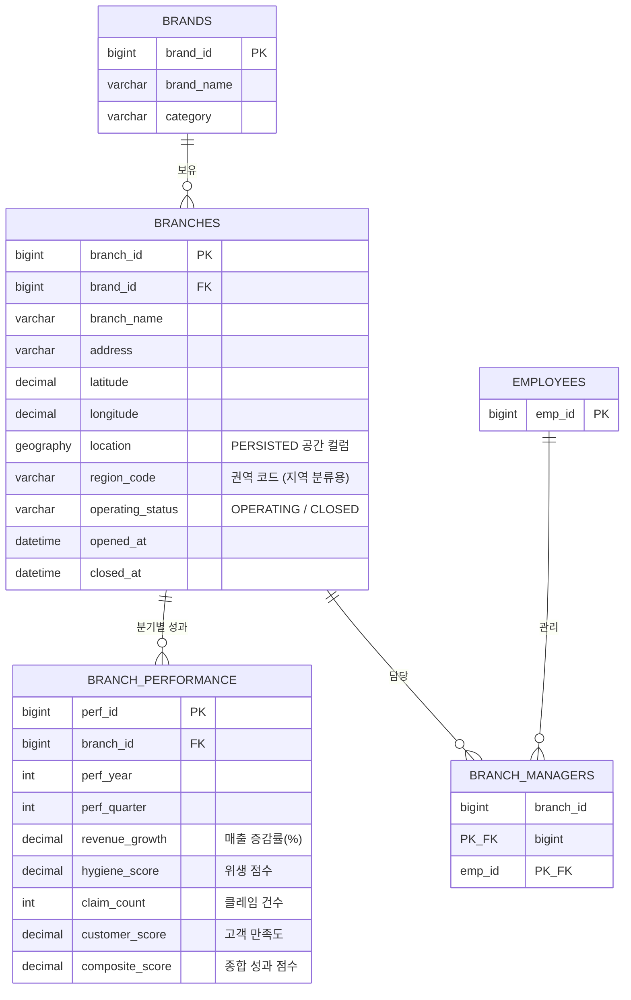
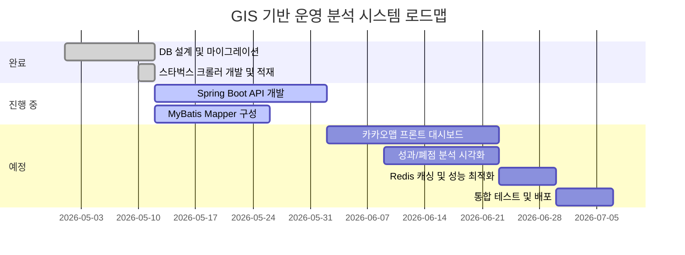

# GIS 기반 프랜차이즈 내부 운영 분석 시스템 (EES 고도화) 구현 계획서

기존의 인사 평가 시스템(EES)을 확장하여, **단일 프랜차이즈(스타벅스) 내부 지점 운영 데이터와 직원 성과 데이터를 통합 분석**하는 GIS 기반 운영 분석 플랫폼으로 고도화합니다.

> "직원 성과는 지점 환경과 지역 특성의 영향을 받는다"는 가설 하에, 공간 데이터 기반으로 운영 효율 분석 → 관리자 성과 연계 → 폐점 위험 예측까지 이어지는 통합 인사이트를 제공합니다.

> [!NOTE]
> **MVP 범위**: 이번 버전에서는 **스타벅스 매장 데이터 수집·좌표 적재 → 카카오맵 기반 지도 시각화 → 지역별 성과 분석 대시보드**까지 구현하는 것을 목표로 합니다.

---

## User Review Required

> [!IMPORTANT]
> **카카오맵 API 키 발급 필요**: 프론트엔드 시각화를 위해 카카오 개발자 센터에서 발급받은 JavaScript API 키가 필요합니다.
> 키는 절대 소스코드에 하드코딩하지 않고 Azure WebApp 환경변수(`KAKAO_MAP_API_KEY`)로 보호해야 합니다.

> [!IMPORTANT]
> **MSSQL 공간 데이터 지원**: `GEOGRAPHY` 타입 지원 및 반경 검색 성능을 위해 **Spatial Index** 적용이 필수입니다.

> [!WARNING]
> **기존 `employees_51` 테이블 비수정 원칙**: 직접 스키마를 수정하지 않고, 연결 테이블(`branch_managers_51`)로 지점-관리자 관계를 매핑합니다.

---

## 프로젝트 방향 (Scope 정의)

### ❌ 제거된 기능 (상권 분석 → 제거)
- 경쟁 브랜드 반경 분석 (스타벅스 500m 내 이디야 수)
- `competitorBrandId` 필드 및 타 브랜드 비교 기능
- 다중 브랜드 크롤링

### ✅ 핵심 분석 기능 (내부 운영 분석)
| 분석 영역 | 내용 |
|---|---|
| **지역별 성과 분석** | 강남권/홍대권 등 권역별 평균 성과, 클레임 비율 비교 |
| **관리자 성과 연계** | 담당 지점 성과 → EES 관리자 KPI 연동 |
| **폐점 위험 분석** | 매출 감소율, 클레임 증가 지점 시각화 |
| **동일 브랜드 밀집도** | 스타벅스 내부 과밀 지역 분석 (운영 최적화) |
| **HeatMap 시각화** | 지점 성과 기반 히트맵, 밀집도 히트맵 |

---

## 1. Data Pipeline Architecture (데이터 파이프라인 설계)

스타벅스 단일 브랜드에 집중하여 전국 매장 데이터를 수집하고, 운영 분석에 필요한 데이터를 적재합니다.


### 파이프라인 상세
1. **Crawler (Python)**: 스타벅스 공개 매장 안내 페이지에서 제공하는 데이터(지점명, 주소, 좌표 포함)를 수집합니다. *(해당 페이지는 공개된 매장 정보를 제공하며, 좌표값도 함께 확인 가능하여 별도 Geocoding 불필요)*
2. **Validation**: 중복 제거(`UNIQUE: brand_id + branch_name`), 좌표값 유효성 검사.
3. **ETL 적재**: Jenkins Cron 또는 Spring Scheduler를 활용한 주 1회 증분(Incremental) 업데이트.
4. **성과 데이터**: `branch_performance_51`에 분기별 운영 지표(매출 증감율, 위생 점수, 클레임, 고객 만족도) 입력.

---

## 2. Database Schema & ERD (DB 설계)

### Entity Relationship Diagram (ERD)


### 설계 핵심 원칙
- **기존 테이블 수정 없음**: `employees_51`은 건드리지 않고 `branch_managers_51`로 브릿지 연결.
- **공간 인덱스**: `GEOGRAPHY::Point(latitude, longitude, 4326)` 컬럼에 `SPATIAL INDEX` 적용 → 반경 검색 고성능 보장.
- **UNIQUE 제약**: `(brand_id, branch_name)` 복합 유니크로 크롤러 중복 삽입 방지 (`MERGE` 활용).
- **운영 상태 추적**: `operating_status`, `opened_at`, `closed_at`으로 폐점 위험 분석 지원.

---

## 3. 핵심 분석 기능 및 API 설계

### 3-1. 지역별 성과 분석 API
```
GET /api/branches/performance/by-region
→ region_code 기준 집계: 평균 composite_score, claim_count 등
```

### 3-2. 관리자 성과 연계 API (EES 핵심 연동)
```
GET /api/managers/{empId}/performance
→ branch_managers_51 → branch_performance_51 JOIN
→ 담당 지점 평균 성과 + 분기별 KPI 추세
```

### 3-3. 폐점 위험 지점 분석 API
```
GET /api/branches/risk
→ revenue_growth < -10% OR claim_count > 임계값
→ operating_status = 'OPERATING' 지점 중 위험 신호 추출
```

### 3-4. 밀집도 분석 API (동일 브랜드)
```
GET /api/branches/density?lat=&lng=&radius=
→ STDistance 기반 반경 내 동일 브랜드 지점 수 반환
→ 과밀 지역 운영 최적화 분석
```

### 성능 전략
- **Spatial Index**: 반경 검색 쿼리(`STDistance`) 성능 보장.
- **Redis 캐싱**: 집계 결과(지역별 평균 성과 등) TTL 1시간 캐시.
  - 캐시 키 예: `cache:performance:region:{region_code}`
- **일반 인덱스**: `brand_id`, `region_code`, `operating_status` 컬럼 인덱스 추가.

---

## 4. 프론트엔드 시각화 계획 (카카오맵 Dashboard)

| 시각화 요소 | 기술 | 분석 목적 |
|---|---|---|
| **성과 HeatMap** | Kakao HeatMap | 지점 composite_score 기반 권역별 성과 집중 시각화 |
| **폐점 위험 마커** | 커스텀 마커 (빨간/노란/초록) | 위험 등급에 따른 지점 마커 색상 분류 |
| **마커 클러스터링** | MarkerClusterer | 전국 848개 지점 렌더링 성능 최적화 |
| **밀집도 HeatMap** | Kakao HeatMap | 동일 브랜드 과밀 지역 파악 |
| **Bubble Map** | 커스텀 오버레이 | 지점별 composite_score에 비례한 버블 크기 표현 |
| **관리자 담당 구역** | Polygon 오버레이 | 담당 관리자 권역 및 성과 시각화 |

---

## 5. 장애·운영·보안 정책

- **크롤러 Fault Tolerance**: 네트워크 실패 시 Exponential Backoff (1→2→4초), 최대 3회 재시도.
- **Ethical Crawling**: `robots.txt` 준수, 요청 간 `sleep` 적용, 개인 식별 정보 수집 금지.
- **보안**: API 키는 환경변수 또는 Azure Key Vault 관리. DB 비밀번호 하드코딩 금지.
- **트랜잭션**: 적재 실패 시 배치 단위 롤백 보장.

---

## 6. 프로젝트 로드맵



---

## 7. 주요 리스크 및 완화 방안

| 리스크 | 완화 방안 |
|---|---|
| 스타벅스 API 구조 변경 | 예외 로깅 강화 + 알림 설정으로 파서 수정 체계화 |
| 성과 데이터 부재 | 초기에는 랜덤 기반 Mock 데이터 생성 후 실제 데이터 교체 |
| 공간 쿼리 부하 | Spatial Index + Redis 캐시 초기 구축 필수 |
| EES 연동 복잡도 | `branch_managers_51` 브릿지 테이블로 기존 테이블 영향 최소화 |
